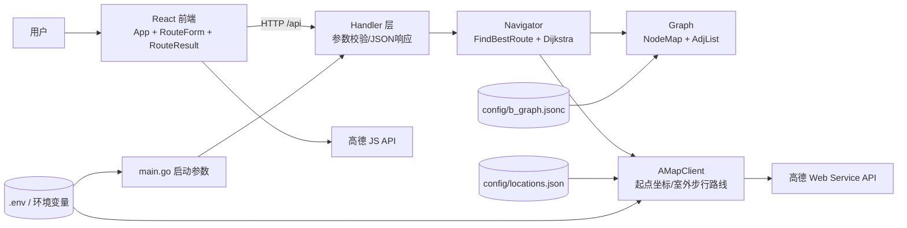
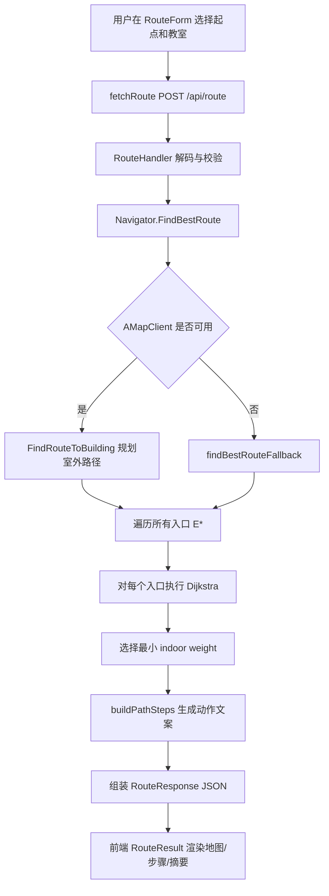

# PROJECT_GUIDE

> 面向读者：第一次接触本仓库、希望从“能跑起来”走到“能讲架构、能改代码、能用于面试阐述”的开发者。
>
> 学习目标：读完后你应能独立解释系统的端到端链路，定位核心模块，完成一项中等改动（例如新增起点或调整导航文案）并自证正确性。

---

## 1) 项目全景（目标、场景、核心能力）

### 为什么看这一章
先建立“这项目到底解决什么问题”的全局心智模型，后面读模块时才不会迷失在实现细节里。

### 关键结论
- 这是一个“室外 + 室内”分段导航系统：室外靠高德 API，室内靠图最短路（Dijkstra）。
- 后端是核心业务引擎，前端主要负责输入组织与结果可视化。
- 数据驱动程度高：室内路径依赖 `config/b_graph.jsonc`，室外点位依赖 `config/locations.json`。

### 细节展开
- **业务目标**：从宿舍区起点导航到 B 楼某教室，输出可执行的分步指引，而不仅是“最短距离”。见 `README.md:3`、`README.md:7`、`README.md:8`。
- **后端核心能力**：
  - 加载拓扑图并构建邻接表，支撑快速最短路查询（`internal/graph/graph.go:55`、`internal/graph/graph.go:94`）。
  - 结合高德室外路径与室内最短路，返回统一结果结构（`internal/navigation/navigation.go:154`、`internal/navigation/navigation.go:210`）。
  - 提供 API：`/api/route`、`/api/rooms`、`/api/starts` 等（`cmd/server/main.go:58` 到 `cmd/server/main.go:63`）。
- **前端核心能力**：
  - 首次加载拉取起点/教室列表并分组（`frontend/src/App.jsx:35`、`frontend/src/App.jsx:62`）。
  - 发起导航请求并展示室外地图与室内步骤（`frontend/src/api/index.js:15`、`frontend/src/components/RouteResult.jsx:148`、`frontend/src/components/RouteResult.jsx:199`）。
- **运行形态**：
  - 后端默认端口 8080（`cmd/server/main.go:31` 到 `cmd/server/main.go:34`）。
  - 前端开发服务器默认 5173，并通过代理转发 `/api` 到 8080（`frontend/vite.config.js:9` 到 `frontend/vite.config.js:17`）。

### 本章小结
你可以把项目理解为“配置驱动的校园导航引擎 + Web UI”。下一章我们把这个结论画成架构图，明确每一层的边界与依赖方向。

---

## 2) 架构设计（含 Mermaid 图）

### 为什么看这一章
架构图决定了你改动时的“落点”：改配置、改算法、改接口还是改展示。

### 关键结论
- 系统是典型的前后端分离：前端只依赖 HTTP API，不直接接触图算法。
- 后端内部是“Handler -> Navigator -> Graph/AMapClient”的调用栈。
- 两份配置文件分别服务室内与室外，职责清晰但需要协同维护。

### 细节展开

- **后端启动链路**（按执行顺序）：
  1. 读取 `.env`（`cmd/server/main.go:25`）。
  2. 读取端口与图路径（`cmd/server/main.go:31`、`cmd/server/main.go:36`）。
  3. `LoadGraph` 构建内存图（`cmd/server/main.go:41`）。
  4. 创建 `Navigator` 与 `AMapClient` 并绑定（`cmd/server/main.go:47` 到 `cmd/server/main.go:52`）。
  5. 注册 API 路由并启动 HTTP 服务（`cmd/server/main.go:55` 到 `cmd/server/main.go:71`）。
  6. 监听信号做优雅停机（`cmd/server/main.go:90` 到 `cmd/server/main.go:101`）。
- **前端启动链路**：`main.jsx` 注入主题与根组件（`frontend/src/main.jsx:15`），`App` 首次并发拉取基础数据（`frontend/src/App.jsx:35`）。

### 本章小结
架构上最重要的边界是：算法与数据契约在后端、交互与呈现在前端。下一章进入目录与文件定位，建立“从哪个文件开始读最省时间”的路径。

---

## 3) 目录结构与关键文件定位

### 为什么看这一章
你需要一个“最短阅读路径”，避免在 100+ 文件里漫游。

### 关键结论
- 先读 `main -> handler -> navigation -> graph/amap`，再读前端 `App -> RouteForm/RouteResult`。
- 配置文件和测试文件是理解设计意图的捷径，不是附属品。
- 命令入口以 `mise.toml` 为主，前端命令在 `frontend/package.json`。

### 细节展开

**建议阅读优先级（从高到低）**

| 优先级 | 文件 | 你会获得什么 |
|---|---|---|
| P0 | `cmd/server/main.go` | 启动流程、路由总览、依赖装配 |
| P0 | `internal/handler/handler.go` | API 契约、参数校验、错误响应结构 |
| P0 | `internal/navigation/navigation.go` | 业务核心：最短路 + 文案生成 |
| P1 | `internal/graph/graph.go` | 图模型、JSONC 加载、邻接表构建 |
| P1 | `internal/amap/amap.go` | 室外路线、降级策略、配置驱动坐标 |
| P1 | `internal/amap/location_store.go` | 地点配置索引与校验规则 |
| P1 | `config/b_graph.jsonc` | 室内节点/边权重数据契约 |
| P1 | `config/locations.json` | 室外起点与目标坐标契约 |
| P2 | `frontend/src/App.jsx` | 前端状态流与接口编排 |
| P2 | `frontend/src/components/RouteResult.jsx` | 结果可视化与高德 JS 集成 |
| P2 | `internal/navigation/navigation_test.go` | 核心算法最小可验证样例 |

**构建与测试命令（来自仓库）**
- 后端运行：`mise run start`（`mise.toml`）或 `go run ./cmd/server`。
- 联合开发：`mise run dev-all`（`mise.toml`），同时启动后端 `8080` 与前端 `5173`。
- 后端测试：`mise run test`（`mise.toml`）或 `go test ./... -v`。
- 后端格式化：`mise run fmt`（`mise.toml`）或 `go fmt ./...`。
- 前端开发：`pnpm dev`（`frontend/package.json:8`）。
- 前端构建：`pnpm build`（`frontend/package.json:9`）。
- 已验证：当前仓库执行 `go test ./... -v` 通过。

### 本章小结
你已经有了“从哪读”和“怎么跑”的地图。下一章切入最重要的一条链路：一次导航请求如何穿过所有层并返回结果。

---

## 4) 端到端数据流（含 Mermaid 流程图）

### 为什么看这一章
面试和实战改动中，最常被问的是“一个请求到底怎么走”。

### 关键结论
- `/api/route` 是主业务流，经历“校验 -> 室外路径 -> 室内最短路 -> 文案生成 -> 返回”。
- 室内外结果在 `RouteResult` 中合并，前端按 `outdoor` 与 `indoor` 两块渲染。
- 如果没有高德 Web 服务 Key，室外距离会降级为估算值，但流程不崩。

### 细节展开

- **入口到输出的关键调用点**：
  - 前端提交：`frontend/src/api/index.js:15`。
  - 后端请求校验：`internal/handler/handler.go:73`、`internal/handler/handler.go:92`。
  - 主流程：`internal/navigation/navigation.go:154`。
  - 室外路线：`internal/amap/amap.go:374`。
  - 室内最短路：`internal/navigation/navigation.go:94`。
  - 步骤文案：`internal/navigation/navigation.go:270`、`internal/navigation/navigation.go:294`。
  - 响应结构：`internal/handler/handler.go:23`。
- **补充：页面初始化流**
  - `App` 并发拉取 `/api/starts` 与 `/api/rooms`（`frontend/src/App.jsx:35`）。
  - 前端自行按区域/楼层分组，后端保持“原始列表”职责（`frontend/src/App.jsx:42`、`frontend/src/App.jsx:63`）。

### 本章小结
你已经掌握了“请求怎么流动”。下一章把关键模块逐个拆开，回答“每个模块内部到底在做什么、为什么这样做”。

---

## 5) 核心模块精讲（逐模块）

### 为什么看这一章
端到端知道“怎么走”还不够，能否独立改代码取决于你是否理解每个模块的边界和内部机制。

### 关键结论
- `graph` 决定“可达性”和成本基线。
- `navigation` 决定“选哪条路”与“怎么讲给用户听”。
- `amap` 决定室外真实度与降级稳定性。
- `handler` 决定 API 契约稳定性。
- 前端模块负责把后端语义正确映射到交互与可视化。

### 细节展开

#### 5.1 `internal/graph`：图加载与索引
- **在做什么**：读取 JSONC，去注释后反序列化，构建 `NodeMap` + `AdjList`（`internal/graph/graph.go:50`、`internal/graph/graph.go:61`、`internal/graph/graph.go:75`）。
- **为什么这样设计**：
  - `NodeMap` 让节点查找 O(1)，用于高频路径查询前置校验。
  - `AdjList` 适合稀疏图，遍历邻居成本低。
- **依赖关系**：被 `navigation` 直接依赖（`internal/navigation/navigation.go:79`）。
- **常见误区**：
  - 误以为 `assumptions.costs` 参与运行时计算；实际上权重以 `edges[].w` 为准（`internal/graph/graph.go:94`）。
  - 修改节点不补边，导致“节点存在但不可达”。

#### 5.2 `internal/navigation`：路径计算与可读文案
- **在做什么**：
  - `FindShortestPath` 用优先队列实现 Dijkstra（`internal/navigation/navigation.go:94` 到 `internal/navigation/navigation.go:147`）。
  - `FindBestRoute` 先做室外，再在所有入口中选最短室内路径（`internal/navigation/navigation.go:168`、`internal/navigation/navigation.go:183`）。
  - `buildPathSteps` + `describeAction` 产出用户动作语义（`internal/navigation/navigation.go:270`、`internal/navigation/navigation.go:298`）。
- **为什么这样设计**：
  - “入口择优”比固定入口更稳健，能适配不同目标教室。
  - 文案函数通过邻接推断参照教室，降低 E1/ST 编号的认知门槛（`internal/navigation/navigation.go:325`、`internal/navigation/navigation.go:344`）。
- **依赖关系**：依赖 `graph` 数据和 `amap` 客户端（`internal/navigation/navigation.go:8`、`internal/navigation/navigation.go:79`）。
- **常见误区**：
  - 以为 `startName` 会影响室内路径；当前室内仍是“入口到目的地”最短路。
  - 以为文案是静态模板；实际受图连边变化影响。

#### 5.3 `internal/amap`：室外路径与点位配置
- **在做什么**：
  - 启动时加载 `config/locations.json` 并构建索引（`internal/amap/amap.go:154`、`internal/amap/location_store.go:47`）。
  - 按显示名查起点坐标，规划到 B 楼目标点（`internal/amap/amap.go:222`、`internal/amap/amap.go:374`）。
  - 无 Web 服务 Key 时用球面距离估算，确保服务可用（`internal/amap/amap.go:294`）。
- **为什么这样设计**：项目注释明确强调“稳定可复现”优先于运行时地理检索（`internal/amap/amap.go:223` 到 `internal/amap/amap.go:239`）。
- **依赖关系**：被 `navigation` 用于室外段，被 `handler` 用于起点/坐标 API。
- **常见误区**：
  - 以为起点可随便传字符串；实际必须命中配置索引。
  - 以为 `GetExitLocations` 提供出口坐标；当前实现返回空数组（`internal/amap/amap.go:393`）。

#### 5.4 `internal/handler`：协议层与边界保护
- **在做什么**：
  - CORS 处理预检（`internal/handler/handler.go:57`）。
  - 路由级方法限制与参数校验（`internal/handler/handler.go:73`、`internal/handler/handler.go:86`）。
  - 统一 JSON 输出与错误结构（`internal/handler/handler.go:230`、`internal/handler/handler.go:235`）。
- **为什么这样设计**：让前端只处理稳定结构，降低 UI 分支复杂度。
- **常见误区**：
  - 目的地校验只检查 `B` 前缀（`internal/handler/handler.go:92`），并未校验楼层位数合法性。

#### 5.5 前端 `App + RouteForm + RouteResult`
- **在做什么**：
  - `App` 管理全局状态与加载生命周期（`frontend/src/App.jsx:23` 到 `frontend/src/App.jsx:29`）。
  - `RouteForm` 负责输入合法性与提交（`frontend/src/components/RouteForm.jsx:34` 到 `frontend/src/components/RouteForm.jsx:45`）。
  - `RouteResult` 同时渲染地图、室内步骤、路径摘要（`frontend/src/components/RouteResult.jsx:148`、`frontend/src/components/RouteResult.jsx:191`、`frontend/src/components/RouteResult.jsx:260`）。
- **为什么这样设计**：API 请求统一放 `frontend/src/api/index.js`，组件保持“展示 + 交互”职责分离（`frontend/src/api/index.js:7`）。
- **常见误区**：
  - 起点按“名称包含区域关键词”分组，新增区域名时前端需同步逻辑（`frontend/src/App.jsx:43` 到 `frontend/src/App.jsx:51`）。
  - 楼层分组取 `room.substring(1, 2)`，默认只适配单数字楼层（`frontend/src/App.jsx:65`）。

### 本章小结
现在你知道了每个模块“做什么 + 为什么这样做 + 容易误解什么”。下一章上升一层，讨论关键设计决策及其取舍。

---

## 6) 关键设计决策与权衡

### 为什么看这一章
“会改代码”要升级为“会做判断”，必须理解每个设计背后的约束与代价。

### 关键结论
- 该项目整体策略是：优先稳定、可解释、可降级，而不是追求最复杂的实时最优。
- 核心取舍集中在三件事：配置驱动、分段导航、可读文案。

### 细节展开

| 设计决策 | 为什么这样做 | 替代方案 | 取舍 |
|---|---|---|---|
| 坐标配置驱动而非运行时地理编码 | 避免同名地点漂移，保证可复现（`internal/amap/amap.go:223`） | 每次实时 Geocode | 配置维护成本上升，但稳定性更高 |
| 室外和室内分段建模 | 室外道路网络与室内拓扑差异大（`internal/navigation/navigation.go:168`） | 构建统一大图 | 实现简单且可控，但跨域最优性有限 |
| 无 API Key 也可返回结果 | 保证演示和开发可用（`internal/amap/amap.go:294`） | 无 Key 直接失败 | 可用性高，但距离/耗时是估算 |
| 入口文案用“附近教室”描述 | 用户更容易现场辨识（`internal/navigation/navigation.go:325`） | 直接显示 E1/E2 编号 | 可读性高，但文案逻辑更复杂 |
| Handler 统一错误结构 | 降低前端解析成本（`internal/handler/handler.go:235`） | 各接口自定义错误结构 | 一致性高，灵活性略受限 |

- **代码可确认结论**：降级估算链路已统一改用标准库 `math`（`internal/amap/amap.go:438` 起），不再依赖自定义三角函数近似实现。这样做能提升可维护性与数值稳定性，同时不影响“有 Key 走高德 API、无 Key 走估算”的主流程分层。

### 本章小结
你已具备“设计层面的解释能力”。下一章回到实操，整理最容易踩坑的触发条件与排查路径。

---

## 7) 易踩坑清单（含触发条件与排查建议）

### 为什么看这一章
很多改动失败不是算法错，而是契约、配置、环境与文档不一致导致。

### 关键结论
- 先查配置路径和 API 字段，再查算法。
- 这个仓库里“文档与实现轻微漂移”是主要风险源之一。

### 细节展开

| 坑点 | 触发条件 | 现象 | 排查建议 |
|---|---|---|---|
| `GRAPH_PATH` 手动设为不存在文件 | `.env` 里配置了 `GRAPH_PATH=graph.json` 但仓库没有该文件 | 服务启动时报图文件不存在 | 若想用默认兼容逻辑，请删除 `GRAPH_PATH`；或显式设置为 `config/b_graph.jsonc`（`cmd/server/main.go:36`） |
| `/api/exits` 坐标仍为 0 | `locations.json` 未配置 `type=entrance` 点位 | 出口有名称但 `lat/lng` 为 0 | 后端已支持按入口 ID 绑定坐标（`internal/amap/amap.go:391`、`internal/handler/handler.go:162`），可按需补齐入口点位配置 |
| 图数据重复边 | 手工编辑 `b_graph.jsonc` | 误判权重异常或改动未生效 | 当前已有重复边示例：`config/b_graph.jsonc:811` 与 `config/b_graph.jsonc:796` 同对节点；加载时后写覆盖前写（`internal/graph/graph.go:95`） |
| 前端楼层分组忽略非标准房间号 | 房间 ID 不是 `B` + 数字（如历史脏数据） | 目的地下拉里该项不显示 | 当前逻辑会跳过无法提取楼层的房间（`frontend/src/App.jsx:17`）；建议保持房间 ID 规范 |
| 目的地格式校验更严格 | 传入非 `B` + 3 位数字（如 `B30`、`BXYZ`） | 直接返回 400 | 校验规则在 `internal/handler/handler.go:13` 与 `internal/handler/handler.go:94`，必要时按新教室编码规则同步调整 |
| 后端未托管前端静态资源 | 直接访问 `http://localhost:8080` 期待完整页面 | 只得到 API 服务 | 使用 Vite dev server（`frontend/vite.config.js:9`）或单独部署前端产物 |

- **代码可确认结论**：仓库默认接入方式是“前端同域请求 `/api` + 反向代理转发到 Go 服务”。依据是前端 API 基址写死为相对路径（`frontend/src/api/index.js:7`）、开发代理也按 `/api -> 8080` 演示（`frontend/vite.config.js:14`）、后端只暴露 API 且不托管前端静态文件（`cmd/server/main.go:58`）。因此若要做“前后端分域直连”，需要先改前端 API 基址配置，而不是开箱即用。

### 本章小结
你已经有了一份可直接用于排错的检查单。下一章补齐“必须懂的外部知识”，把代码理解迁移成可复用能力。

---

## 8) 外部知识点清单（为什么必须懂）

### 为什么看这一章
项目代码只是载体，真正可迁移的是背后的通用工程知识。

### 关键结论
- 这个项目覆盖了图算法、Web API、前端异步状态和地图服务集成四大知识域。
- 不懂这些知识点，你只能“照着改”；懂了才能“举一反三”。

### 细节展开
- **Dijkstra + 最小堆**：解释为什么每次弹出的节点是当前最优、时间复杂度如何估算；对应 `internal/navigation/navigation.go:102` 到 `internal/navigation/navigation.go:133`。
- **图建模方法**：节点类型（room/stair/entrance）和边权重如何映射真实场景；对应 `config/b_graph.jsonc:2`、`config/b_graph.jsonc:694`。
- **HTTP/CORS/预检**：前后端分离下为什么必须处理 OPTIONS；对应 `internal/handler/handler.go:63`。
- **配置驱动设计**：为什么把坐标和拓扑放配置而非硬编码；对应 `internal/amap/location_store.go:34`、`internal/graph/graph.go:55`。
- **React Hooks 数据流**：`useEffect` 加载、`useState` 状态分层、`useCallback` 稳定引用；对应 `frontend/src/App.jsx:31`、`frontend/src/App.jsx:88`。
- **Vite 代理机制**：开发环境如何避免跨域与硬编码域名；对应 `frontend/vite.config.js:10`。
- **高德双 Key 机制**：后端 Web 服务 Key 与前端 JS Key 作用不同；对应 `.env.example:19` 到 `.env.example:37`。

### 本章小结
到这里你已经具备“技术点到代码点”的映射能力。下一章用自测题检验你是否真的形成可表达、可实战的理解。

---

## 9) 自测题（8 题）+ 参考答案

### 为什么看这一章
学习闭环的关键是“可验证”。会看不等于会讲，会讲不等于会改。

### 关键结论
- 能答出“为什么”与“改哪里”，才算通过。

### 细节展开
1. **问**：`/api/route` 的室内路径是如何决定入口的？
   **答**：遍历所有 `Graph.GetExits()`，对每个入口跑 `FindShortestPath`，选 `weight` 最小的路径；见 `internal/navigation/navigation.go:178` 到 `internal/navigation/navigation.go:193`。

2. **问**：为什么要在启动时执行 `godotenv.Load()`？
   **答**：为了让 `go run/mise run start` 直接读取本地 `.env`，同时不覆盖系统环境变量；见注释 `cmd/server/main.go:21` 到 `cmd/server/main.go:25`。

3. **问**：如果没配置 `AMAP_API_KEY`，系统会完全不可用吗？
   **答**：不会。`WalkingRoute` 会回退为基于 haversine 的估算距离和耗时；见 `internal/amap/amap.go:294` 到 `internal/amap/amap.go:313`。

4. **问**：前端为什么不直接请求 `http://localhost:8080/api`？
   **答**：开发阶段通过 Vite 代理 `/api`，减少环境耦合并规避跨域；见 `frontend/vite.config.js:10` 到 `frontend/vite.config.js:17`。

5. **问**：新增一个起点“海棠公寓 18 号楼”最少要改哪？
   **答**：优先改 `config/locations.json` 新增 `type=start` 点位；若区域分组名未覆盖，再改 `frontend/src/App.jsx:43` 的分组逻辑。

6. **问**：为什么说 `assumptions.costs` 不直接控制运行时路径？
   **答**：运行时读取的是 `edges[].w` 写入邻接表；见 `internal/graph/graph.go:94` 到 `internal/graph/graph.go:97`。

7. **问**：室内步骤文案“某某教室之间的楼梯”是写死的吗？
   **答**：不是，基于邻接关系动态推断参照教室；见 `internal/navigation/navigation.go:377` 到 `internal/navigation/navigation.go:406`。

8. **问**：若用户输入 `destination=301` 会发生什么？
   **答**：`RouteHandler` 会因非 `B` 前缀返回 400；见 `internal/handler/handler.go:92` 到 `internal/handler/handler.go:95`。

### 本章小结
如果你能在不看代码的情况下答对 6 题以上，已经具备“可面试阐述”的基础。最后一章给出 7 天落地计划，帮助你从理解走向独立改动。

---

## 10) 7 天学习计划（每天目标、建议阅读文件、验收标准）

### 为什么看这一章
系统学习最怕“知道很多但不会落地”。计划化学习能把理解转成稳定输出。

### 关键结论
- 先打通主链路，再钻算法与契约，最后做小改动闭环。

### 细节展开

| 天数 | 每天目标 | 建议阅读文件 | 验收标准 |
|---|---|---|---|
| Day 1 | 跑通后端与前端，记住入口命令 | `mise.toml`、`cmd/server/main.go`、`frontend/vite.config.js` | 可独立启动前后端并解释端口/代理关系 |
| Day 2 | 吃透 API 契约与错误处理 | `internal/handler/handler.go`、`frontend/src/api/index.js` | 能手写一份 `/api/route` 请求与响应示例并说明错误分支 |
| Day 3 | 理解图模型与数据契约 | `internal/graph/graph.go`、`config/b_graph.jsonc` | 能解释节点类型、边权重含义，并定位任意房间邻接关系 |
| Day 4 | 理解 Dijkstra 与路径组装 | `internal/navigation/navigation.go`、`internal/navigation/navigation_test.go` | 能口述 FindShortestPath 的关键步骤并通过测试 |
| Day 5 | 理解室外路线与降级策略 | `internal/amap/amap.go`、`internal/amap/location_store.go`、`config/locations.json` | 能解释“有/无 API Key”两种结果差异 |
| Day 6 | 理解前端状态流与结果渲染 | `frontend/src/App.jsx`、`frontend/src/components/RouteForm.jsx`、`frontend/src/components/RouteResult.jsx` | 能追踪一次提交从按钮点击到界面更新全过程 |
| Day 7 | 完成一次小改动并自证 | 推荐改动：新增起点、优化一条文案、补一个测试 | 提交前可说明改动影响范围、验证命令与回滚点 |

### 本章小结
7 天计划完成后，你应达到三个结果：
1) 可讲清架构；2) 可独立做小到中等改动；3) 可在面试中解释关键取舍与排错思路。

---

## 回总：把“会看”升级为“会改、会讲”

这份项目的学习主线是：
1. 先建立全景与边界；
2. 再打通端到端主链路；
3. 最后沉到模块与设计取舍。

如果你接下来要开始实战，建议优先选择“改配置不改算法”的任务（如新增起点、调整边权、修正文案），完成 2~3 个闭环后再进入算法层重构。
