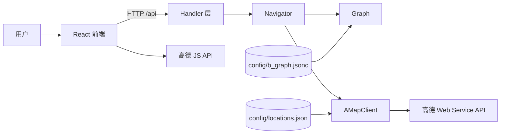

# xdu-b-nav

西电 B 楼导航系统，基于 Go + React 的室内外分段导航应用。后端负责加载楼内拓扑图、计算室内最短路径并组合室外步行路线；前端提供起点与教室选择、路线展示和高德地图渲染能力。

## 功能特点

- **室外导航**：可接入高德 Web 服务 API，从宿舍起点规划到 B 楼目标点的步行路线；未配置 Key 时降级为距离估算。
- **室内导航**：基于 `config/b_graph.jsonc` 中的节点和边权重，使用 Dijkstra 算法计算入口到教室的最短路径。
- **入口择优**：遍历 B 楼入口，自动选择到目标教室室内成本最低的入口。
- **配置驱动坐标**：运行时读取 `config/locations.json`，避免依赖实时地理检索导致点位漂移。
- **Web 界面**：Vite + React + MUI 前端，支持起点/教室选择、路线步骤、加载态和错误态展示。

## 架构



后端内部调用栈：`Handler -> Navigator -> Graph / AMapClient`。两份配置文件分别服务室内与室外，职责清晰。

## 项目结构

```text
xdu-b-nav/
├── cmd/server/            # Go 服务入口
│   └── main.go
├── config/                # 运行配置数据
│   ├── b_graph.jsonc      # B 楼室内拓扑图数据
│   └── locations.json     # 宿舍起点与 B 楼目标点坐标
├── frontend/              # Vite + React 前端项目
│   ├── package.json
│   ├── vite.config.js
│   └── src/
├── internal/
│   ├── amap/              # 高德 API、地点坐标与降级路线
│   ├── graph/             # 图数据结构、JSONC 加载与邻接表构建
│   ├── handler/           # HTTP API、参数校验与 JSON 响应
│   └── navigation/        # Dijkstra 与室内外路线组合
├── go.mod
└── go.sum
```

## 快速开始

### 环境要求

- Go 1.21+
- Node.js + pnpm
- go-task（可选，推荐）

### 安装依赖

```bash
# 后端
go mod tidy

# 前端
cd frontend
pnpm install
```

### 配置环境变量（可选）

```bash
cp .env.example .env
```

| 变量名 | 说明 | 默认值 |
| --- | --- | --- |
| `PORT` | 后端 HTTP 服务端口 | `8080` |
| `GRAPH_PATH` | 室内图数据文件路径 | 未设置时回退到 `config/b_graph.jsonc` |
| `LOCATION_CONFIG_PATH` | 坐标配置路径 | `config/locations.json` |
| `AMAP_API_KEY` | 高德 Web 服务 API Key | 空；为空时降级为距离估算 |
| `AMAP_JS_API_KEY` | 高德 JS API Key | 空 |
| `AMAP_SECURITY_CODE` | 高德 JS API 安全密钥 | 空 |

### 启动服务

推荐使用 `task`：

```bash
task start        # 运行 Go 后端服务
task dev-all      # 同时启动后端与前端开发服务器
task build        # 构建后端二进制
task test         # 运行 Go 单元测试
task fmt          # 执行 Go 格式化
task --list-all   # 查看所有可用任务
```

或直接运行：

```bash
go run ./cmd/server         # 后端
cd frontend && pnpm dev    # 前端
```

前端开发服务器默认监听 `http://localhost:5173`，通过 Vite 代理把 `/api` 转发到 `http://localhost:8080`。

## API 接口

所有接口均返回 JSON。后端已开启 CORS。

### POST `/api/route`

获取从宿舍起点到 B 楼教室的组合导航路线。

请求体：

```json
{
  "start": "丁香公寓 12 号楼",
  "destination": "B301"
}
```

参数说明：

| 字段 | 类型 | 说明 |
| --- | --- | --- |
| `start` | string | 起点显示名称，需匹配 `config/locations.json` 中启用的 `type=start` 点位 |
| `destination` | string | 目标教室，格式为 `B` + 3 位数字 |

成功响应示例：

```json
{
  "success": true,
  "outdoor": {
    "from": "丁香公寓 12 号楼",
    "to": "B301",
    "nearest_exit": "E1",
    "distance": 500,
    "duration": 360,
    "instructions": ["沿道路步行到达 B 楼南楼"]
  },
  "indoor": [
    {
      "from": "E1",
      "to": "B101",
      "weight": 8,
      "description": "从B101附近的出入口进入大楼",
      "action": "进入"
    }
  ],
  "total_weight": 150,
  "path": ["E1", "B101", "S_ST1_F1", "S_ST1_F3", "B301"]
}
```

错误响应示例：

```json
{
  "success": false,
  "error_message": "目的地格式错误，应该是教室号（如 B301）"
}
```

### GET `/api/rooms`

获取所有可用教室列表。

```json
{ "rooms": ["B101", "B102", "B301"] }
```

### GET `/api/exits`

获取 B 楼入口列表。

### GET `/api/starts`

获取可选宿舍起点列表。

### GET `/api/config`

获取前端地图所需配置（高德 Key 等）。

### GET `/api/coordinates`

获取坐标映射，顺序为 `[lng, lat]`。

## 配置数据约定

### 室内图数据：`config/b_graph.jsonc`

- `nodes`：节点定义
- `edges`：边定义，`w` 直接作为边权重

节点 ID 约定：

- `Bxxx`：教室/房间节点，例如 `B301`
- `S_ST{n}_F{m}`：第 `n` 个楼梯在第 `m` 层的楼梯口
- `E{n}`：入口/出口节点

约束：

- 节点 ID 必须唯一
- 每条边的两端都必须存在于 `nodes`
- 修改边权时直接调整对应 `edges[].w`

### 坐标数据：`config/locations.json`

| 字段 | 说明 |
| --- | --- |
| `id` | 点位唯一标识 |
| `type` | `start` / `destination` / `entrance` |
| `region` | 所属区域 |
| `display_name` | 前端展示和 API 入参使用的短名称 |
| `full_name` | 完整地理名称 |
| `lat` / `lng` | 纬度 / 经度 |
| `enabled` | 是否启用 |

## 开发指南

### 添加新教室

1. 在 `config/b_graph.jsonc` 的 `nodes` 中添加教室节点
2. 在 `edges` 中添加与走廊/楼梯/入口相连的边
3. 运行 `go test ./... -v` 验证

### 修改室内路径成本

直接修改 `config/b_graph.jsonc` 中对应边的 `w`。运行时不会从 `assumptions.costs` 自动推导。

### 添加或调整宿舍起点

1. 在 `config/locations.json` 中添加/修改 `type=start` 点位
2. 确保 `display_name` 与 API 入参一致
3. 若新增区域不属于现有分组，需同步调整前端 `frontend/src/App.jsx` 的分组逻辑

## 测试

```bash
task test          # 全部测试
go test ./... -v   # 同上
go fmt ./...       # 格式化
```

## License

MIT
